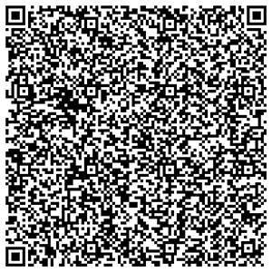

# Google Authenticator Decoder

This Java library can take the large QR code that Google Authenticator produces when you
export all the accounts and will break out all the OTP account strings and parse them into
their individual components.

It uses the artifacts generated from [OTPAuth Migration Decoder](https://github.com/digitalduke/otpauth-migration-decoder)
to perform the heavy lifting from the string that is extracted from the QR code.

Usage of the library is very simple, but it requires a little prep work first.

You need Python 3.9 installed and its bin folder needs to be in your PATH environment variable.

With that working, you need to run this command from a command prompt so that the resource is
available to the library:

```bash
pip3.9 install click
```

## How to get the library into your project
The project is available as a Maven dependency on Central. Add the following to your POM file:

```xml
<dependency>
    <groupId>com.simtechdata</groupId>
    <artifactId>GoogleAuthDecoder</artifactId>
    <version>1.0.0</version>
</dependency>
```

Or, if using Gradle to build, add this to your Gradle build file

```groovy
compile group: 'com.simtechdata', name: 'GoogleAuthDecoder', version: 1.0.0
```

You can even use it from a Groovy script!

```groovy
@Grapes(
  @Grab(group='com.simtechdata', module='GoogleAuthDecoder', version=1.0.0)
)
```

Once you have the dependency added to your project, this is how you use the library:

First, open Google Authenticator and tap on the ellipses at the upper right and chose to export your accounts.
    			
Then, click on continue then authenticate however it asks you to do so.
    			
All of your accounts should be selected by default, at which point you click on Export at the bottom right of the screen.
    			
Next, take a screenshot and save it to wherever you're going to use this library.
    			
You can click on CANCEL at the upper right instead of Next, because when you click on Next, it's going to want to delete
all of your accounts in Google Authenticator and that might not be of interest to you.
    			
The last thing you need to do, is crop that screenshot so that it only has the QR code in the image, then save it as a .PNG file.

## Do not change the size of the image, just CROP it

Your final png should look similar to this:



Use that file as the File object that you pass into the constructor.

When you're done cropping your image, it MUST be a perfect square (the width and height are the same value). Never 
change the size of your image, just make sure you crop it evenly on both sides.    			 
## Example Usage
Let's say that my png file exists in my Pictures folder in my home folder. This is how you would instantiate the library
```java
File imageFile = new File("/Users/username/Pictures/myQRCode.png");
Decoder decoder = new Decoder(imageFile);
```
If your final png file happens to be larger than 1,000 x 1,000 pixels, then you need to use the second constructor
and pass in a size that is rounded up to the next 50. So for example, if your image size is 1330 x 1330, then you 
would do this
```java
File imageFile = new File("/Users/username/Pictures/myQRCode.png");
Decoder decoder = new Decoder(imageFile, 1350);
```
if your image size is 1375 x 1375, then pass in 1400 as the image size, etc.

The library is going to resize your image then OVERWRITE your image file, so if you want to keep a copy of the original
png file, make a copy of it and use the copy in the File object.

Once the class has been instantiated, it will have two Lists that you can call on and iterate through.

The first list will contain OTPRecord objects, and the second list will just have Strings. The Strings list will
simply be the raw lines that were generated by the Python script. The OTPRecords will have the granular data that 
you can extract from each account, in addition to having decoded the html %FF strings that end up in the main auth string.

See the ```TestMain``` class under the Test folder to learn how to extract each accounts specific pieces of data.

***
This is a MODULAR library compiled with Java version 18.0.1. It uses features that are only available in higher
versions of java (Such as the Record class). If you want to use this library in lower versions of Java, then 
modify the code and compile for your own needs.
***

Have fun!
